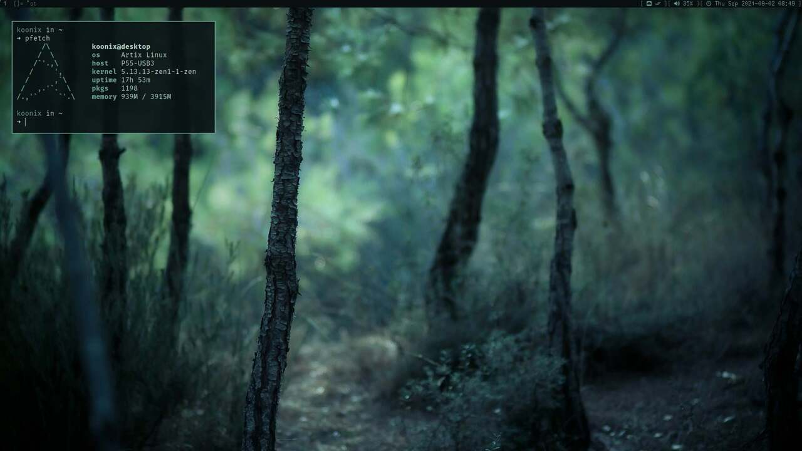
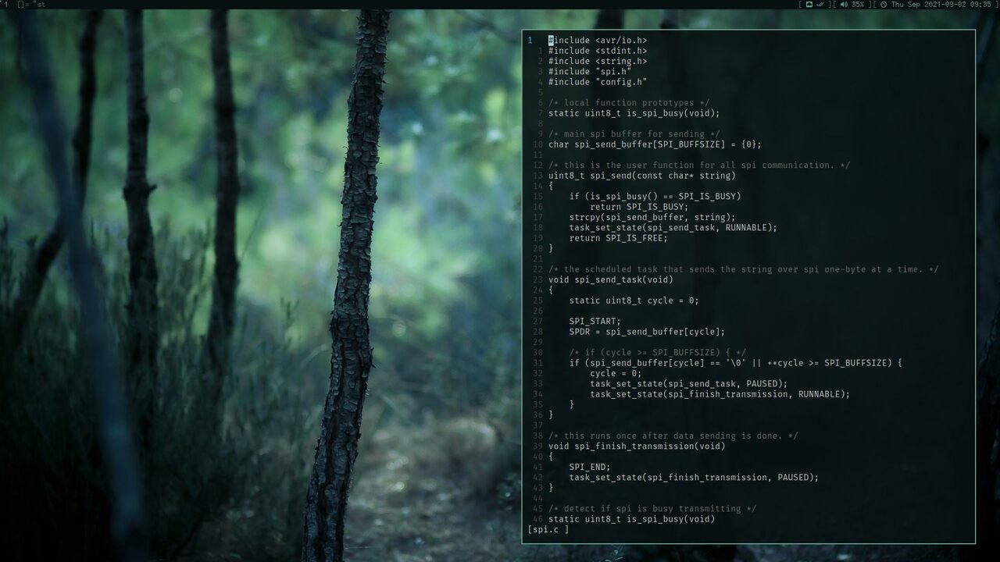

# dotfiles

- dwm: [soystemd/dwm](https://github.com/soystemd/dwm)
- statusbar: [soystemd/dwmBar](https://github.com/soystemd/dwmbar)
- st: [soystemd/st](https://github.com/soystemd/st)
- dmenu: [soystemd/dmenu](https://github.com/soystemd/dmenu)
- slock: [soystemd/slock](https://github.com/soystemd/slock)
- sxiv: [soystemd/sxiv-flexipatch](https://github.com/soystemd/sxiv-flexipatch)
